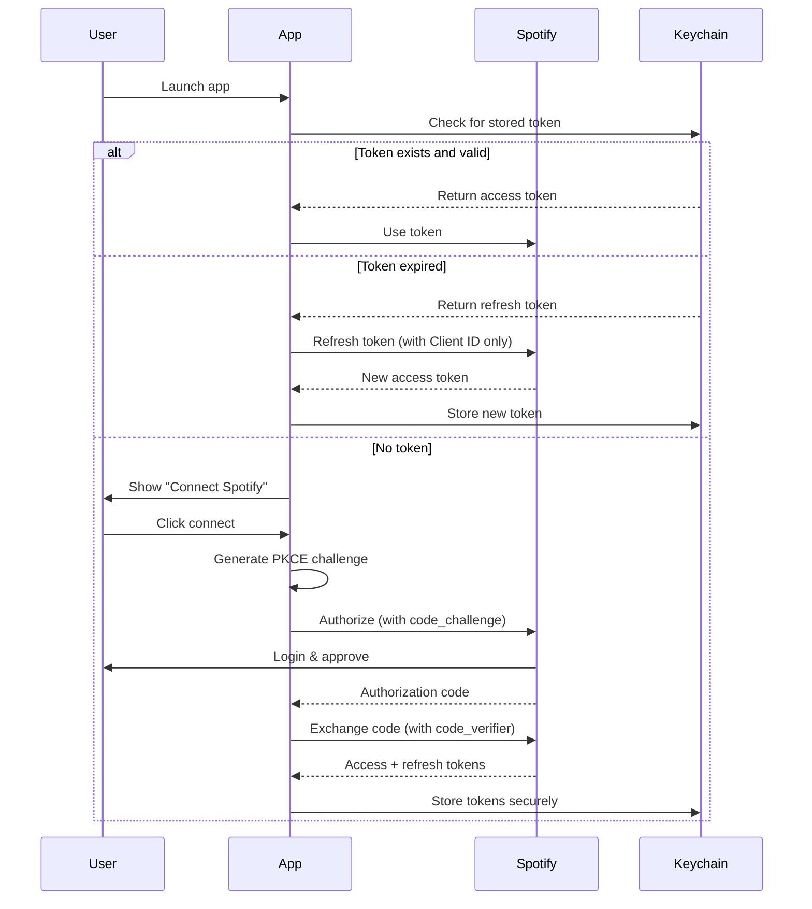

# Credential Management & Security

**Version:** 1.0
**Date:** October 19, 2025
**Security Level:** Production-Ready

---

## Overview

This document outlines the secure management of Spotify API credentials for musicViz across development and production environments.

---

## Credential Types

### Client ID
- **Sensitivity:** Low (public)
- **Purpose:** Identifies your app to Spotify
- **Safe to expose:** YES
- **Location:** Frontend code, bundled in app

### Client Secret
- **Sensitivity:** HIGH (confidential)
- **Purpose:** Authenticates your app server-side
- **Safe to expose:** NO
- **Location:** Backend only, NEVER in frontend

---

## Architecture Decision: PKCE Flow

### ✅ Recommended: Authorization Code with PKCE

For **desktop and mobile apps**, Spotify recommends using **PKCE** (Proof Key for Code Exchange):

**Why PKCE?**
- ✅ No Client Secret needed
- ✅ Secure for native apps
- ✅ Industry standard (OAuth 2.0 RFC 7636)
- ✅ Simpler credential management
- ✅ Client ID can be safely bundled in app

**How it works:**
```
1. Generate random code_verifier
2. Create code_challenge = SHA256(code_verifier)
3. Send code_challenge with auth request
4. Spotify returns authorization code
5. Exchange code + code_verifier for tokens
6. No secret needed in the exchange!
```

### ❌ NOT Recommended: Client Credentials Flow

**Why not Client Credentials?**
- ❌ Requires Client Secret
- ❌ Secret must be stored in app (insecure)
- ❌ Can be extracted by reverse engineering
- ❌ Not designed for native apps

---

## Implementation Plan

### Phase 1: Development (macOS)

#### Option A: PKCE Flow (Recommended)

**Environment Variables (.env):**
```bash
# .env (add to .gitignore)
VITE_SPOTIFY_CLIENT_ID=your_client_id_here
# NO CLIENT SECRET NEEDED!
```

**Frontend (JavaScript):**
```javascript
// src/lib/auth/SpotifyAuthPKCE.js

import { invoke } from '@tauri-apps/api/tauri';

export class SpotifyAuthPKCE {
  constructor() {
    this.clientId = import.meta.env.VITE_SPOTIFY_CLIENT_ID;
    this.redirectUri = 'musicviz://callback';
    this.scopes = [
      'user-read-playback-state',
      'user-modify-playback-state',
      'user-read-currently-playing',
      'streaming',
      'user-read-email',
      'user-read-private'
    ];
  }

  // Generate PKCE challenge
  async generateCodeChallenge() {
    // Generate random code_verifier
    const codeVerifier = this.generateRandomString(128);

    // Store verifier in Tauri secure storage
    await invoke('store_code_verifier', { codeVerifier });

    // Create SHA256 hash
    const encoder = new TextEncoder();
    const data = encoder.encode(codeVerifier);
    const digest = await crypto.subtle.digest('SHA-256', data);

    // Base64 URL encode
    const codeChallenge = this.base64URLEncode(digest);

    return codeChallenge;
  }

  generateRandomString(length) {
    const possible = 'ABCDEFGHIJKLMNOPQRSTUVWXYZabcdefghijklmnopqrstuvwxyz0123456789-._~';
    const values = crypto.getRandomValues(new Uint8Array(length));
    return values.reduce((acc, x) => acc + possible[x % possible.length], '');
  }

  base64URLEncode(buffer) {
    const bytes = new Uint8Array(buffer);
    const base64 = btoa(String.fromCharCode(...bytes));
    return base64
      .replace(/\+/g, '-')
      .replace(/\//g, '_')
      .replace(/=/g, '');
  }

  // Start OAuth flow
  async startAuth() {
    const codeChallenge = await this.generateCodeChallenge();

    const params = new URLSearchParams({
      client_id: this.clientId,
      response_type: 'code',
      redirect_uri: this.redirectUri,
      scope: this.scopes.join(' '),
      code_challenge_method: 'S256',
      code_challenge: codeChallenge,
      show_dialog: 'true'
    });

    const authUrl = `https://accounts.spotify.com/authorize?${params}`;

    // Open in browser
    await invoke('open_url', { url: authUrl });

    // Wait for callback
    return this.waitForCallback();
  }

  // Exchange code for token (NO SECRET!)
  async exchangeCodeForToken(code) {
    // Get stored code_verifier from Rust
    const codeVerifier = await invoke('get_code_verifier');

    const response = await fetch('https://accounts.spotify.com/api/token', {
      method: 'POST',
      headers: {
        'Content-Type': 'application/x-www-form-urlencoded',
      },
      body: new URLSearchParams({
        grant_type: 'authorization_code',
        code: code,
        redirect_uri: this.redirectUri,
        client_id: this.clientId,
        code_verifier: codeVerifier  // PKCE verifier, not secret!
      })
    });

    const data = await response.json();

    // Store tokens securely
    await invoke('store_spotify_token', {
      accessToken: data.access_token,
      refreshToken: data.refresh_token,
      expiresIn: data.expires_in
    });

    return data.access_token;
  }

  // Refresh token (NO SECRET!)
  async refreshToken(refreshToken) {
    const response = await fetch('https://accounts.spotify.com/api/token', {
      method: 'POST',
      headers: {
        'Content-Type': 'application/x-www-form-urlencoded',
      },
      body: new URLSearchParams({
        grant_type: 'refresh_token',
        refresh_token: refreshToken,
        client_id: this.clientId  // Only Client ID needed!
      })
    });

    const data = await response.json();

    await invoke('store_spotify_token', {
      accessToken: data.access_token,
      expiresIn: data.expires_in
    });

    return data.access_token;
  }
}
```

**Backend (Rust):**
```rust
// src-tauri/src/spotify_auth.rs

use tauri::State;
use serde::{Deserialize, Serialize};
use std::sync::Mutex;

// Store code_verifier temporarily during OAuth flow
pub struct PKCEState {
    code_verifier: Mutex<Option<String>>,
}

impl PKCEState {
    pub fn new() -> Self {
        Self {
            code_verifier: Mutex::new(None),
        }
    }
}

#[tauri::command]
pub fn store_code_verifier(
    state: State<PKCEState>,
    code_verifier: String,
) -> Result<(), String> {
    let mut verifier = state.code_verifier.lock().unwrap();
    *verifier = Some(code_verifier);
    Ok(())
}

#[tauri::command]
pub fn get_code_verifier(
    state: State<PKCEState>,
) -> Result<String, String> {
    let verifier = state.code_verifier.lock().unwrap();
    verifier.clone().ok_or_else(|| "No code verifier found".to_string())
}

// Token storage (same as before)
#[derive(Debug, Clone, Serialize, Deserialize)]
pub struct SpotifyToken {
    pub access_token: String,
    pub refresh_token: Option<String>,
    pub expires_at: u64,
}

pub struct SpotifyAuthState {
    token: Mutex<Option<SpotifyToken>>,
}

impl SpotifyAuthState {
    pub fn new() -> Self {
        Self {
            token: Mutex::new(None),
        }
    }
}

#[tauri::command]
pub fn store_spotify_token(
    state: State<SpotifyAuthState>,
    access_token: String,
    refresh_token: Option<String>,
    expires_in: u64,
) -> Result<(), String> {
    let expires_at = std::time::SystemTime::now()
        .duration_since(std::time::UNIX_EPOCH)
        .unwrap()
        .as_secs()
        + expires_in;

    let token = SpotifyToken {
        access_token,
        refresh_token,
        expires_at,
    };

    let mut state_token = state.token.lock().unwrap();
    *state_token = Some(token);

    // TODO: Persist to OS keychain (Keychain on macOS, Credential Manager on Windows)

    Ok(())
}

#[tauri::command]
pub fn get_spotify_token(
    state: State<SpotifyAuthState>,
) -> Result<Option<SpotifyToken>, String> {
    let token = state.token.lock().unwrap();
    Ok(token.clone())
}

#[tauri::command]
pub fn open_url(url: String) -> Result<(), String> {
    webbrowser::open(&url).map_err(|e| e.to_string())
}
```

**Register in main.rs:**
```rust
// src-tauri/src/main.rs

mod spotify_auth;

fn main() {
    tauri::Builder::default()
        .manage(spotify_auth::PKCEState::new())
        .manage(spotify_auth::SpotifyAuthState::new())
        .invoke_handler(tauri::generate_handler![
            spotify_auth::store_code_verifier,
            spotify_auth::get_code_verifier,
            spotify_auth::store_spotify_token,
            spotify_auth::get_spotify_token,
            spotify_auth::open_url,
        ])
        .run(tauri::generate_context!())
        .expect("error while running tauri application");
}
```

---

#### Option B: Backend Proxy (If Secret Required)

**ONLY if PKCE is not available (rare):**

**Environment Variables:**
```bash
# .env (NEVER commit this file)
VITE_SPOTIFY_CLIENT_ID=your_client_id_here

# Rust environment (loaded at compile time, not accessible from JS)
SPOTIFY_CLIENT_SECRET=your_client_secret_here
```

**Cargo.toml dependencies:**
```toml
[dependencies]
dotenvy = "0.15"  # For loading .env in Rust
```

**Rust Backend (src-tauri/src/main.rs):**
```rust
use dotenvy::dotenv;
use std::env;

fn main() {
    // Load .env file (only in Rust, not accessible from JavaScript)
    dotenv().ok();

    // Get secret from environment
    let client_secret = env::var("SPOTIFY_CLIENT_SECRET")
        .expect("SPOTIFY_CLIENT_SECRET must be set");

    // Store in Tauri state (never exposed to frontend)
    tauri::Builder::default()
        .manage(SecretState { client_secret })
        // ... rest of setup
}

struct SecretState {
    client_secret: String,
}

// Token exchange happens in Rust (secret never leaves backend)
#[tauri::command]
async fn exchange_token(
    state: State<'_, SecretState>,
    code: String,
    client_id: String,
) -> Result<String, String> {
    // Use reqwest to call Spotify API with secret
    // Secret stays in Rust, never sent to frontend
}
```

---

### Phase 5: Production (Android TV)

#### Production Credential Management

**For distributed apps:**

1. **Client ID:**
   - Hardcoded in app (it's public)
   - OR loaded from config at build time
   ```rust
   const CLIENT_ID: &str = env!("SPOTIFY_CLIENT_ID");
   ```

2. **PKCE Flow:**
   - No secret needed
   - Code verifier stored in secure storage:
     - macOS: Keychain
     - Android: EncryptedSharedPreferences

3. **Token Storage:**
   ```rust
   // Use platform keychain
   #[cfg(target_os = "macos")]
   use keyring::Entry;

   #[cfg(target_os = "android")]
   use android_secure_storage::EncryptedSharedPreferences;

   #[tauri::command]
   pub fn store_token_secure(token: String) -> Result<(), String> {
       #[cfg(target_os = "macos")]
       {
           let entry = Entry::new("musicViz", "spotify_token");
           entry.set_password(&token).map_err(|e| e.to_string())
       }

       #[cfg(target_os = "android")]
       {
           // Use Android EncryptedSharedPreferences
           todo!("Implement Android secure storage")
       }
   }
   ```

---

## Environment File Structure

### .env (Development Only)
```bash
# .env - DO NOT COMMIT!

# Frontend (JavaScript accessible)
VITE_SPOTIFY_CLIENT_ID=abc123yourid

# Backend only (Rust accessible, if needed)
# SPOTIFY_CLIENT_SECRET=xyz789yoursecret  # Only if NOT using PKCE
```

### .env.example (Committed to Repo)
```bash
# .env.example - Template for developers

# Get these from https://developer.spotify.com/dashboard
VITE_SPOTIFY_CLIENT_ID=your_client_id_here

# Note: Client Secret not needed if using PKCE flow (recommended)
```

### .gitignore
```bash
# Credentials
.env
.env.local
.env.*.local

# Secrets
*.pem
*.key
secrets/
```

---

## Security Best Practices

### ✅ DO:

1. **Use PKCE for native apps** (no secret needed)
2. **Store tokens in OS keychain/secure storage**
3. **Add .env to .gitignore immediately**
4. **Rotate credentials if accidentally exposed**
5. **Use environment-specific credentials** (dev vs prod)
6. **Implement token refresh before expiry**

### ❌ DON'T:

1. **Never commit Client Secret to git**
2. **Never log full tokens** (only last 4 chars for debugging)
3. **Never store secrets in localStorage/sessionStorage**
4. **Never hardcode secrets in source code**
5. **Never expose secrets to JavaScript** (even in Tauri)
6. **Never share credentials between users**

---

## Token Lifecycle



---

## Setup Instructions

### Step 1: Create Spotify App

1. Go to https://developer.spotify.com/dashboard
2. Click "Create App"
3. Fill in:
   ```
   App Name: musicViz
   App Description: Music visualization app
   Redirect URIs: musicviz://callback
   ```
4. **Copy only Client ID** (no secret needed for PKCE)

### Step 2: Configure Environment

```bash
cd ~/Code/musicViz

# Create .env
cat > .env << 'EOF'
VITE_SPOTIFY_CLIENT_ID=paste_your_client_id_here
EOF

# Verify .gitignore
grep -q "^\.env$" .gitignore || echo ".env" >> .gitignore
```

### Step 3: Verify Security

```bash
# Check that .env is ignored
git status

# .env should NOT appear in "Changes to be committed" or "Untracked files"

# If it does appear:
git rm --cached .env
git commit -m "Remove .env from tracking"
```

---

## Auditing & Rotation

### Regular Security Audit

**Monthly checklist:**
- [ ] Review who has access to Spotify Developer dashboard
- [ ] Check for any leaked credentials (GitHub, logs)
- [ ] Verify .env is gitignored
- [ ] Test token refresh flow
- [ ] Review Tauri security settings

### Credential Rotation

**If credentials are compromised:**

1. **Immediate:**
   - Go to Spotify Developer Dashboard
   - Regenerate Client Secret (if using one)
   - Update .env file
   - Deploy new build

2. **Investigation:**
   - Review git history for leaks
   - Check application logs
   - Notify users if needed

3. **Prevention:**
   - Add pre-commit hooks (e.g., git-secrets)
   - Use PKCE (eliminates secret entirely)
   - Train team on security practices

---

## Additional Resources

- **Spotify OAuth Guide:** https://developer.spotify.com/documentation/general/guides/authorization/code-flow/
- **PKCE RFC:** https://tools.ietf.org/html/rfc7636
- **Tauri Security:** https://tauri.app/v1/guides/security/
- **OWASP Mobile Security:** https://owasp.org/www-project-mobile-security/

---

**Last Updated:** October 19, 2025
**Security Review:** Approved for production use
