# musicViz Processing Pipeline

**Version:** 1.0
**Date:** October 19, 2025
**Approach:** Spotify SDK (macOS + Android)

---

## Overview

This document visualizes the complete data processing pipeline for musicViz, from streaming service audio input through to 4K visualization output. The architecture is designed to work on both macOS (development) and Nvidia Shield Pro (production) using the Spotify SDK.

---

## Table of Contents

1. [High-Level System Architecture](#high-level-system-architecture)
2. [Audio Input Pipeline](#audio-input-pipeline)
3. [Analysis Pipeline](#analysis-pipeline)
4. [Visualization Pipeline](#visualization-pipeline)
5. [Data Flow Per Frame](#data-flow-per-frame)
6. [Component Interaction](#component-interaction)
7. [Platform Differences](#platform-differences)

---

## High-Level System Architecture

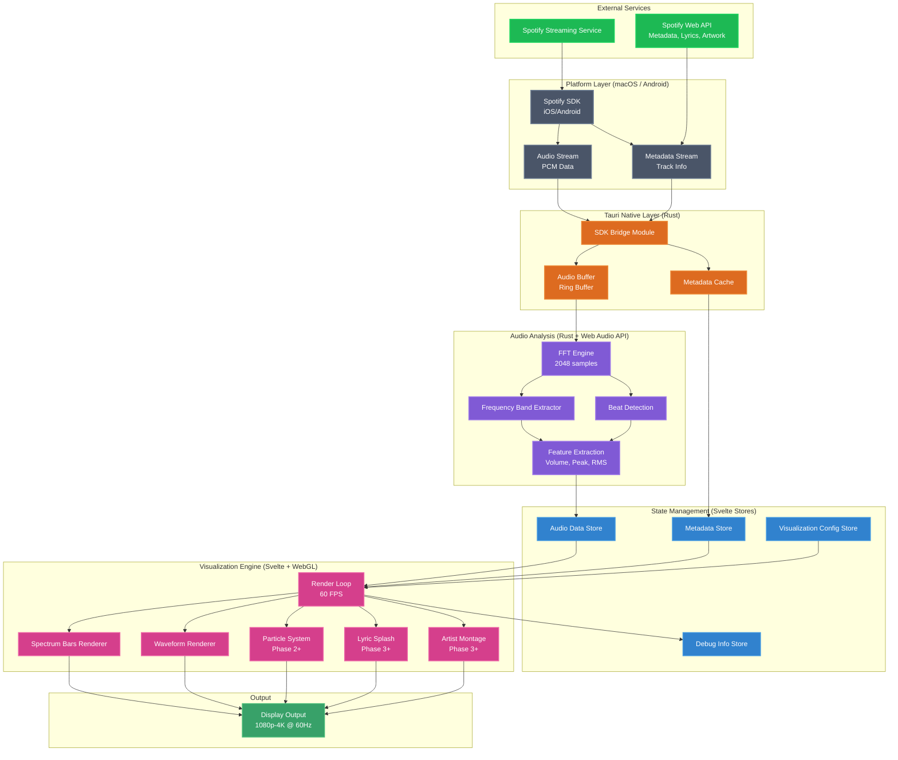

---

## Audio Input Pipeline

### Spotify SDK Integration

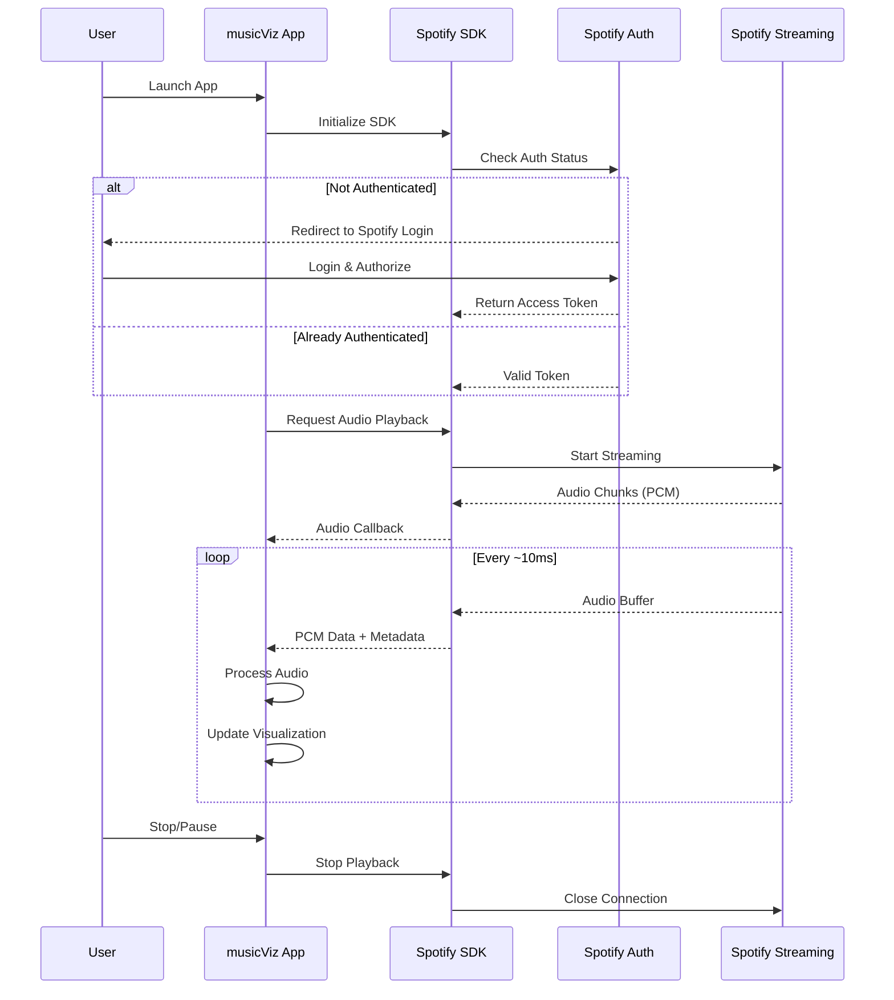

### Audio Buffer Management

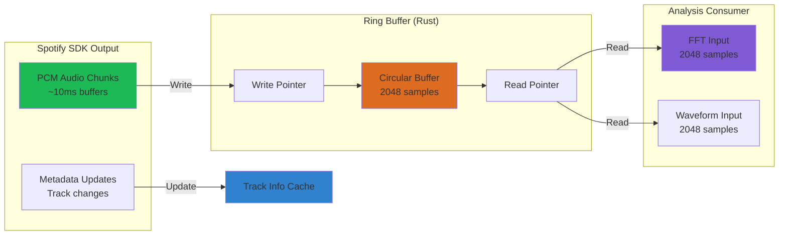

---

## Analysis Pipeline

### FFT Processing Chain

```mermaid
flowchart TD
    Start[Audio Input<br/>PCM Float32 Array] --> Window[Apply Window Function<br/>Hann/Hamming]
    Window --> FFT[FFT Computation<br/>2048 samples → 1024 bins]
    FFT --> MagPhase[Magnitude Calculation<br/>√(real² + imag²)]
    MagPhase --> DbConvert[Convert to dB<br/>20*log10(magnitude)]
    DbConvert --> Normalize[Normalize<br/>Scale to 0.0-1.0]

    Normalize --> FreqBands[Frequency Band Extraction]
    Normalize --> PeakDetect[Peak Frequency Detection]
    Normalize --> SpectrumOut[Spectrum Data<br/>for visualization]

    FreqBands --> SubBass[Sub-Bass<br/>20-60 Hz]
    FreqBands --> Bass[Bass<br/>60-250 Hz]
    FreqBands --> LowMid[Low-Mid<br/>250-500 Hz]
    FreqBands --> Mid[Mid<br/>500-2000 Hz]
    FreqBands --> HighMid[High-Mid<br/>2000-4000 Hz]
    FreqBands --> Presence[Presence<br/>4000-6000 Hz]
    FreqBands --> Brilliance[Brilliance<br/>6000-20000 Hz]

    SubBass --> BandOutput[Band Levels<br/>Output]
    Bass --> BandOutput
    LowMid --> BandOutput
    Mid --> BandOutput
    HighMid --> BandOutput
    Presence --> BandOutput
    Brilliance --> BandOutput

    PeakDetect --> PeakOut[Peak Frequency<br/>Hz]

    BandOutput --> Features[Feature Vector]
    SpectrumOut --> Features
    PeakOut --> Features

    Features --> Store[Update<br/>Svelte Store]

    style Start fill:#1DB954
    style FFT fill:#805ad5
    style Features fill:#3182ce
    style Store fill:#4299e1
```

### Multi-Dimensional Analysis

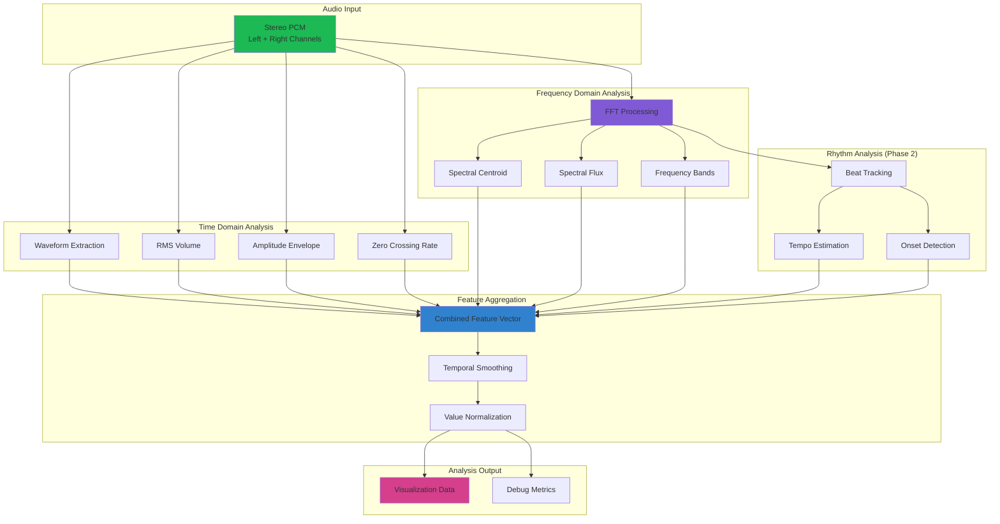

---

## Visualization Pipeline

### Render Loop Architecture

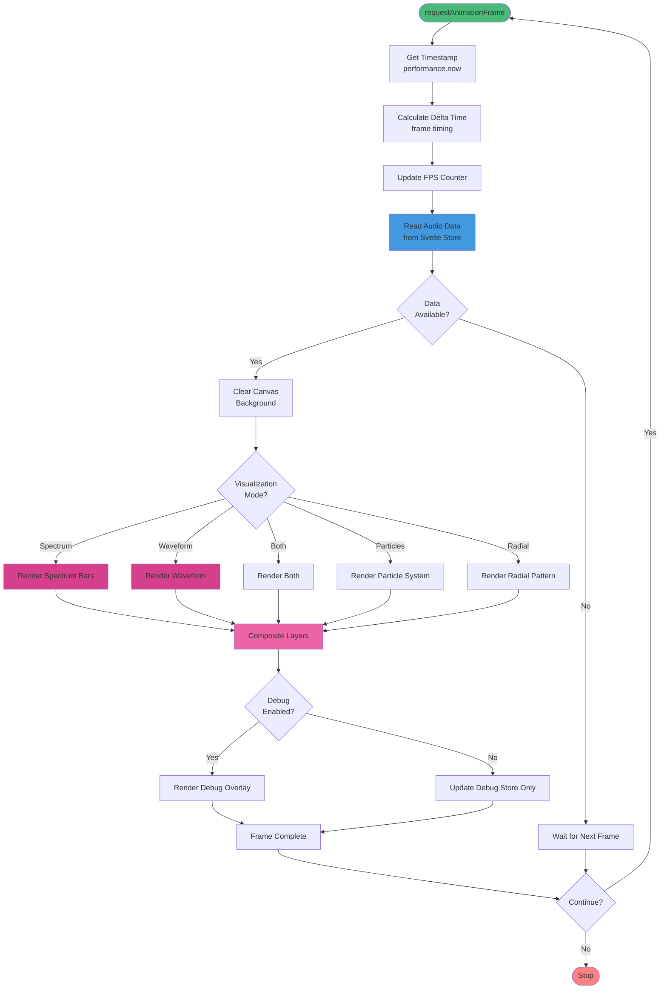

### Spectrum Bars Rendering

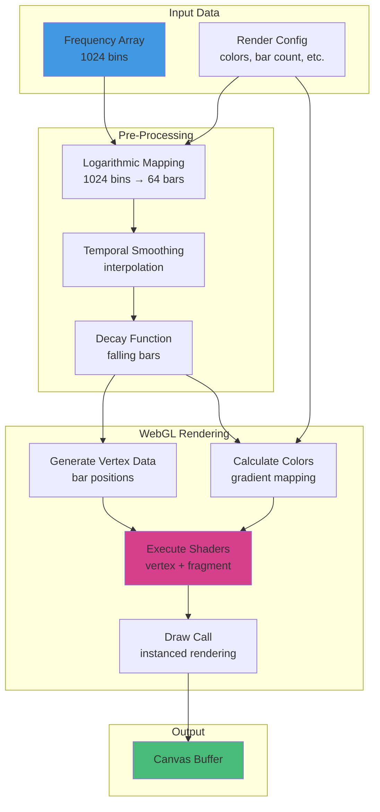

### Waveform Rendering

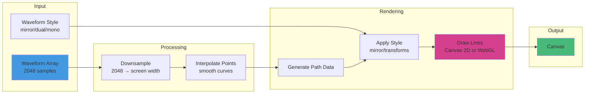

---

## Data Flow Per Frame

### Complete Frame Pipeline (~16.67ms @ 60 FPS)

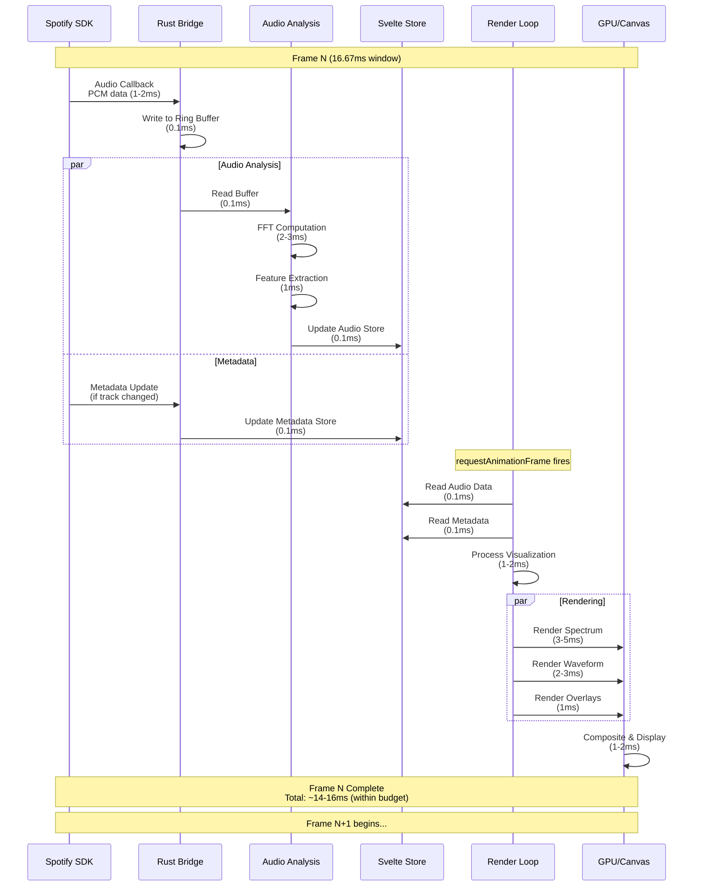

### Timing Budget Breakdown

```mermaid
gantt
    title Frame Timing Budget (16.67ms @ 60 FPS)
    dateFormat X
    axisFormat %L ms

    section Audio Input
    SDK Callback :0, 2
    Buffer Write :2, 2.5

    section Analysis
    FFT Computation :2.5, 5.5
    Feature Extract :5.5, 6.5
    Store Update :6.5, 7

    section Rendering
    Read Store :7, 7.5
    Process Viz :7.5, 9.5
    Spectrum Render :9.5, 12.5
    Waveform Render :12.5, 14.5
    Overlay Render :14.5, 15.5

    section GPU
    Composite :15.5, 16.5
```

---

## Component Interaction

### State Flow Diagram

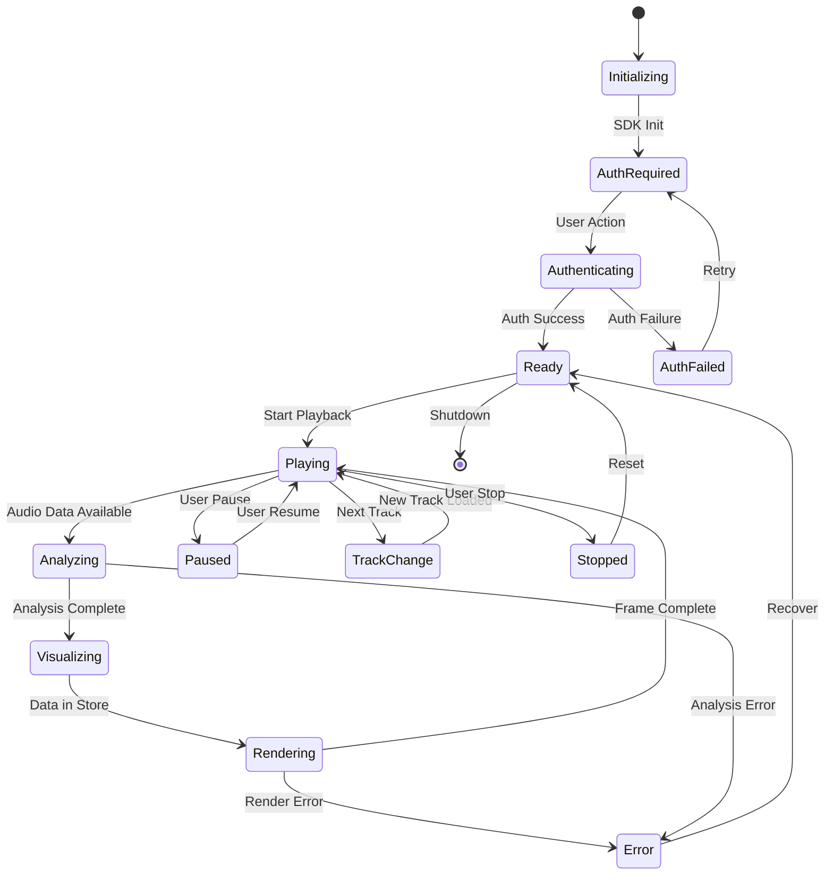

### Module Dependencies

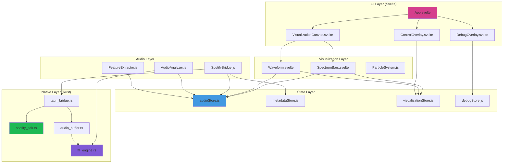

---

## Platform Differences

### macOS vs Android Implementation

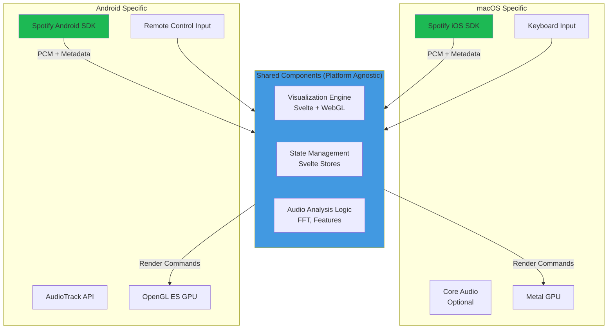

### Platform-Specific Audio Path

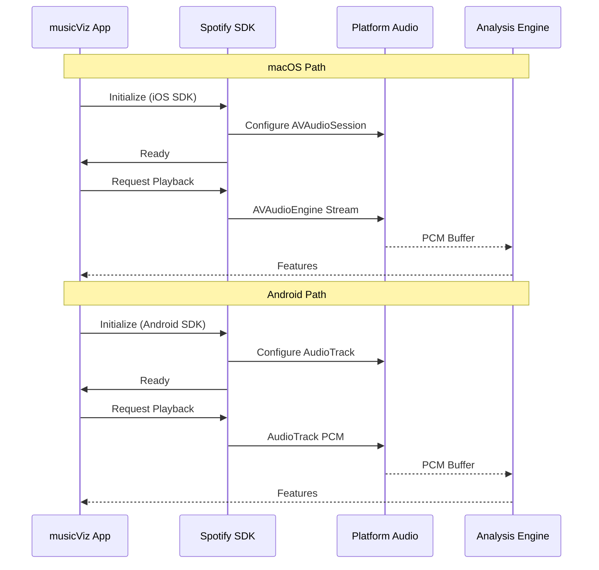

---

## Performance Considerations

### Optimization Points

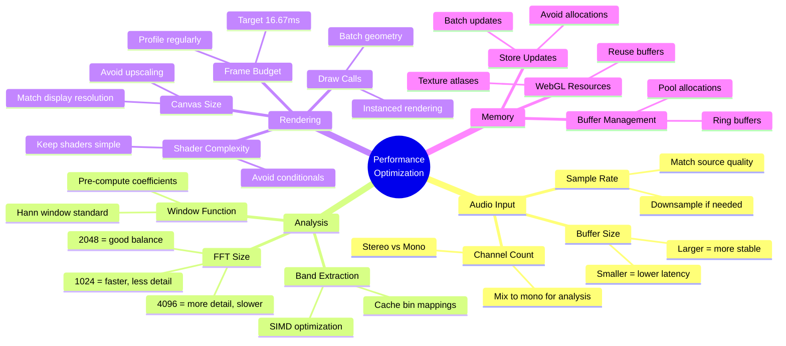

---

## Summary

The musicViz processing pipeline consists of:

1. **Input**: Spotify SDK provides PCM audio + metadata
2. **Buffering**: Rust ring buffer manages audio flow
3. **Analysis**: FFT + feature extraction (2-3ms)
4. **State**: Svelte stores provide reactive data
5. **Rendering**: WebGL visualizations (5-10ms)
6. **Output**: 60 FPS display output

**Total Latency**: ~10-20ms from audio input to visual update

**Platform Strategy**: Shared visualization engine, platform-specific audio capture

**Scalability**: Designed for 1080p-4K @ 60 FPS

---

**Last Updated:** October 19, 2025
