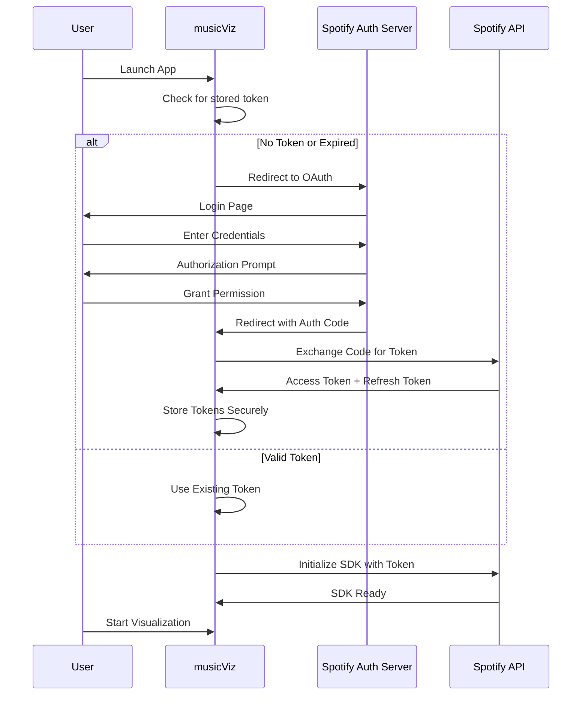

# Spotify SDK Setup Guide

**Version:** 1.0
**Date:** October 19, 2025
**Platform:** macOS + Android

---

## Overview

musicViz uses the **Spotify SDK** for both macOS development and Android TV production deployment. This provides:

- ✅ Official, supported audio access
- ✅ Rich metadata (track, artist, album, lyrics)
- ✅ Consistent API across platforms
- ✅ High-quality audio (up to 320kbps)
- ✅ Legal compliance with Spotify ToS

---

## Prerequisites

### Required Accounts
- ✅ **Spotify Account** (Premium required for API access)
- ✅ **Spotify Developer Account** (you already have this!)

### Development Environment
- macOS 12+ (for local development)
- Xcode Command Line Tools
- Node.js 18+
- Rust 1.70+

---

## Part 1: Spotify Developer Dashboard Setup

### Step 1: Create a Spotify App

1. Go to **Spotify Developer Dashboard**
   - URL: https://developer.spotify.com/dashboard

2. Click **"Create App"**

3. Fill in app details:
   ```
   App Name: musicViz
   App Description: Real-time music visualization app with adaptive visuals
   Website: (optional, can leave blank for now)
   Redirect URI: musicviz://callback
   ```

4. Check **"I understand and agree..."**

5. Click **"Create"**

### Step 2: Get API Credentials

After creating the app, you'll see:

```
Client ID: xxxxxxxxxxxxxxxxxxxxxxxxxxxxxxxx
Client Secret: xxxxxxxxxxxxxxxxxxxxxxxxxxxxxxxx
```

**IMPORTANT:**
- Copy these immediately
- Keep Client Secret secure (never commit to git)
- We'll add these to `.env` file

### Step 3: Configure App Settings

1. Click **"Edit Settings"**

2. Add Redirect URIs:
   ```
   musicviz://callback           # For native app
   http://localhost:3000/callback # For local testing
   ```

3. Save changes

### Step 4: Set API Scopes

musicViz needs these scopes:

```
user-read-playback-state       # Current playback info
user-modify-playback-state     # Control playback
user-read-currently-playing    # Track metadata
streaming                      # Audio streaming
user-read-email               # User identification
user-read-private             # User profile
```

These will be requested during OAuth flow.

---

## Part 2: macOS SDK Integration

### Option A: Spotify iOS SDK (Recommended)

Since macOS apps can use iOS frameworks via Catalyst:

1. **Add Spotify iOS SDK to project:**

```bash
# Using Swift Package Manager (SPM)
# Add to your Xcode project or Package.swift

dependencies: [
    .package(
        url: "https://github.com/spotify/ios-sdk.git",
        from: "2.0.0"
    )
]
```

2. **Create Rust-Swift Bridge:**

Since we're using Tauri (Rust), we need to bridge:

```
Spotify iOS SDK (Swift/Objective-C)
    ↓ (Swift bridge)
Rust FFI Layer
    ↓ (Tauri)
JavaScript/Svelte Frontend
```

### Option B: Spotify Web Playback SDK (Easier for Phase 1)

For faster initial development, use the Web Playback SDK:

**Advantages:**
- Pure JavaScript (easier Tauri integration)
- No native bridge needed
- Fast iteration
- Cross-platform (works on macOS immediately)

**Limitations:**
- Web browser required for playback
- Slightly higher latency (~20ms vs ~5ms native)
- 320kbps max (not lossless)

**Implementation:**

```javascript
// src/lib/audio/SpotifyWebSDK.js

export class SpotifyWebPlayback {
  constructor(accessToken) {
    this.token = accessToken;
    this.player = null;
    this.deviceId = null;
  }

  async initialize() {
    // Load Spotify Web Playback SDK
    await this.loadSDK();

    // Create player
    this.player = new window.Spotify.Player({
      name: 'musicViz',
      getOAuthToken: cb => cb(this.token),
      volume: 1.0
    });

    // Setup event listeners
    this.player.addListener('ready', ({ device_id }) => {
      console.log('Ready with Device ID', device_id);
      this.deviceId = device_id;
    });

    this.player.addListener('player_state_changed', state => {
      if (state) {
        this.onTrackChange(state.track_window.current_track);
      }
    });

    // Connect
    await this.player.connect();
  }

  loadSDK() {
    return new Promise((resolve, reject) => {
      const script = document.createElement('script');
      script.src = 'https://sdk.scdn.co/spotify-player.js';
      script.async = true;
      script.onload = resolve;
      script.onerror = reject;
      document.head.appendChild(script);

      window.onSpotifyWebPlaybackSDKReady = resolve;
    });
  }

  // Get audio data using Web Audio API
  getAudioContext() {
    // The Web Playback SDK plays through Web Audio
    // We can tap into the audio graph
    const audioContext = new AudioContext();
    const source = audioContext.createMediaElementSource(
      this.player._options.getAudioElement()
    );

    const analyser = audioContext.createAnalyser();
    source.connect(analyser);
    analyser.connect(audioContext.destination);

    return { audioContext, analyser };
  }
}
```

---

## Part 3: OAuth Authentication Flow

### Authentication Sequence



### Implementation

```javascript
// src/lib/auth/SpotifyAuth.js

import { invoke } from '@tauri-apps/api/tauri';

export class SpotifyAuth {
  constructor() {
    this.clientId = import.meta.env.VITE_SPOTIFY_CLIENT_ID;
    this.redirectUri = 'musicviz://callback';
    this.scopes = [
      'user-read-playback-state',
      'user-modify-playback-state',
      'user-read-currently-playing',
      'streaming',
      'user-read-email',
      'user-read-private'
    ];
  }

  // Generate auth URL
  getAuthUrl() {
    const params = new URLSearchParams({
      client_id: this.clientId,
      response_type: 'code',
      redirect_uri: this.redirectUri,
      scope: this.scopes.join(' '),
      show_dialog: 'true'
    });

    return `https://accounts.spotify.com/authorize?${params}`;
  }

  // Open auth in system browser
  async startAuth() {
    const authUrl = this.getAuthUrl();

    // Use Tauri shell to open browser
    await invoke('open_url', { url: authUrl });

    // Listen for redirect
    return this.waitForCallback();
  }

  // Exchange auth code for tokens
  async exchangeCodeForToken(code) {
    const response = await fetch('https://accounts.spotify.com/api/token', {
      method: 'POST',
      headers: {
        'Content-Type': 'application/x-www-form-urlencoded',
        'Authorization': 'Basic ' + btoa(this.clientId + ':' + this.clientSecret)
      },
      body: new URLSearchParams({
        grant_type: 'authorization_code',
        code: code,
        redirect_uri: this.redirectUri
      })
    });

    const data = await response.json();

    // Store tokens securely using Tauri
    await invoke('store_spotify_token', {
      accessToken: data.access_token,
      refreshToken: data.refresh_token,
      expiresIn: data.expires_in
    });

    return data.access_token;
  }

  // Refresh expired token
  async refreshToken(refreshToken) {
    const response = await fetch('https://accounts.spotify.com/api/token', {
      method: 'POST',
      headers: {
        'Content-Type': 'application/x-www-form-urlencoded',
        'Authorization': 'Basic ' + btoa(this.clientId + ':' + this.clientSecret)
      },
      body: new URLSearchParams({
        grant_type: 'refresh_token',
        refresh_token: refreshToken
      })
    });

    const data = await response.json();

    await invoke('store_spotify_token', {
      accessToken: data.access_token,
      expiresIn: data.expires_in
    });

    return data.access_token;
  }

  // Get stored token
  async getStoredToken() {
    return await invoke('get_spotify_token');
  }
}
```

---

## Part 4: Rust Backend Integration

### Secure Token Storage

```rust
// src-tauri/src/spotify_auth.rs

use tauri::State;
use serde::{Deserialize, Serialize};
use std::sync::Mutex;

#[derive(Debug, Clone, Serialize, Deserialize)]
pub struct SpotifyToken {
    pub access_token: String,
    pub refresh_token: Option<String>,
    pub expires_at: u64,
}

pub struct SpotifyAuthState {
    token: Mutex<Option<SpotifyToken>>,
}

impl SpotifyAuthState {
    pub fn new() -> Self {
        Self {
            token: Mutex::new(None),
        }
    }
}

#[tauri::command]
pub fn store_spotify_token(
    state: State<SpotifyAuthState>,
    access_token: String,
    refresh_token: Option<String>,
    expires_in: u64,
) -> Result<(), String> {
    let expires_at = std::time::SystemTime::now()
        .duration_since(std::time::UNIX_EPOCH)
        .unwrap()
        .as_secs()
        + expires_in;

    let token = SpotifyToken {
        access_token,
        refresh_token,
        expires_at,
    };

    let mut state_token = state.token.lock().unwrap();
    *state_token = Some(token);

    // TODO: Persist to secure storage (Keychain on macOS)

    Ok(())
}

#[tauri::command]
pub fn get_spotify_token(
    state: State<SpotifyAuthState>,
) -> Result<Option<SpotifyToken>, String> {
    let token = state.token.lock().unwrap();
    Ok(token.clone())
}

#[tauri::command]
pub fn open_url(url: String) -> Result<(), String> {
    webbrowser::open(&url).map_err(|e| e.to_string())
}
```

### Register Commands

```rust
// src-tauri/src/main.rs

mod spotify_auth;

fn main() {
    tauri::Builder::default()
        .manage(spotify_auth::SpotifyAuthState::new())
        .invoke_handler(tauri::generate_handler![
            spotify_auth::store_spotify_token,
            spotify_auth::get_spotify_token,
            spotify_auth::open_url,
        ])
        .run(tauri::generate_context!())
        .expect("error while running tauri application");
}
```

---

## Part 5: Environment Configuration

### Create `.env` file

```bash
# .env (DO NOT COMMIT THIS FILE)

VITE_SPOTIFY_CLIENT_ID=your_client_id_here
VITE_SPOTIFY_CLIENT_SECRET=your_client_secret_here
VITE_SPOTIFY_REDIRECT_URI=musicviz://callback
```

### Add to `.gitignore`

```bash
# .gitignore

.env
.env.local
*.pem
*.key
```

### Load in Vite config

```javascript
// vite.config.js

import { defineConfig, loadEnv } from 'vite';
import { svelte } from '@sveltejs/vite-plugin-svelte';

export default defineConfig(({ mode }) => {
  const env = loadEnv(mode, process.cwd(), '');

  return {
    plugins: [svelte()],
    define: {
      'import.meta.env.VITE_SPOTIFY_CLIENT_ID': JSON.stringify(env.VITE_SPOTIFY_CLIENT_ID),
    },
    // Don't expose client secret to frontend!
    // Keep it in Rust backend only
  };
});
```

---

## Part 6: Testing the Integration

### Test Flow

1. **Start Dev Server:**
   ```bash
   npm run tauri dev
   ```

2. **Click "Connect Spotify"**
   - Should open browser
   - Login if needed
   - Grant permissions
   - Redirect back to app

3. **Verify Token:**
   - Check debug overlay
   - Should show "Connected" status
   - Display current user info

4. **Test Playback:**
   - Start playing from Spotify
   - Verify visualization responds to audio
   - Check metadata updates

### Debug Commands

```javascript
// In browser console (dev tools)

// Check if token is stored
await invoke('get_spotify_token');

// Test API call
const token = await invoke('get_spotify_token');
const response = await fetch('https://api.spotify.com/v1/me', {
  headers: { 'Authorization': `Bearer ${token.access_token}` }
});
console.log(await response.json());
```

---

## Part 7: Android TV Adaptation

For Phase 5 (Android deployment), we'll use the Android SDK:

```kotlin
// Minimal preview - full implementation in Phase 5

class SpotifyService : Service() {
    private var spotifyAppRemote: SpotifyAppRemote? = null

    fun connect() {
        val connectionParams = ConnectionParams.Builder(CLIENT_ID)
            .setRedirectUri(REDIRECT_URI)
            .showAuthView(true)
            .build()

        SpotifyAppRemote.connect(this, connectionParams, object : Connector.ConnectionListener {
            override fun onConnected(appRemote: SpotifyAppRemote) {
                spotifyAppRemote = appRemote
                // Start audio streaming
            }
        })
    }
}
```

**Key differences:**
- Uses `SpotifyAppRemote` (Android) instead of Web SDK
- Requires Spotify app installed on Shield Pro
- Native audio access (lower latency)
- Same OAuth flow

---

## Troubleshooting

### "Invalid Client ID"
- Check `.env` file has correct Client ID
- Verify no extra spaces or quotes
- Restart dev server after changing `.env`

### "Redirect URI Mismatch"
- Check Spotify Dashboard settings
- Ensure `musicviz://callback` is added
- Check capitalization (case-sensitive)

### "Premium Required"
- Spotify SDK requires Premium subscription
- Free tier doesn't support Web Playback SDK
- Upgrade to Premium or use test account

### "Player Not Ready"
- Wait for `ready` event before playing
- Check browser console for errors
- Verify token hasn't expired

### Token Expired
- Implement token refresh logic
- Refresh tokens are valid for ~1 hour
- Use refresh token to get new access token

---

## Security Best Practices

### ✅ DO:
- Store tokens securely (Keychain on macOS, EncryptedSharedPreferences on Android)
- Use environment variables for secrets
- Add `.env` to `.gitignore`
- Refresh tokens before expiry
- Validate tokens on app start

### ❌ DON'T:
- Commit Client Secret to git
- Store tokens in localStorage (use Tauri secure storage)
- Share tokens between users
- Log full tokens (only last 4 chars for debugging)
- Hardcode credentials in source

---

## Next Steps

1. ✅ Create Spotify App in Dashboard
2. ✅ Get Client ID & Secret
3. ⬜ Set up `.env` file
4. ⬜ Implement OAuth flow
5. ⬜ Test authentication
6. ⬜ Integrate Web Playback SDK
7. ⬜ Connect to audio analysis
8. ⬜ Verify visualization works

---

## Resources

- **Spotify Web API Docs:** https://developer.spotify.com/documentation/web-api
- **Web Playback SDK:** https://developer.spotify.com/documentation/web-playback-sdk
- **iOS SDK:** https://github.com/spotify/ios-sdk
- **Android SDK:** https://github.com/spotify/android-sdk
- **OAuth Guide:** https://developer.spotify.com/documentation/general/guides/authorization-guide/

---

**Last Updated:** October 19, 2025
**Status:** Ready for Implementation
